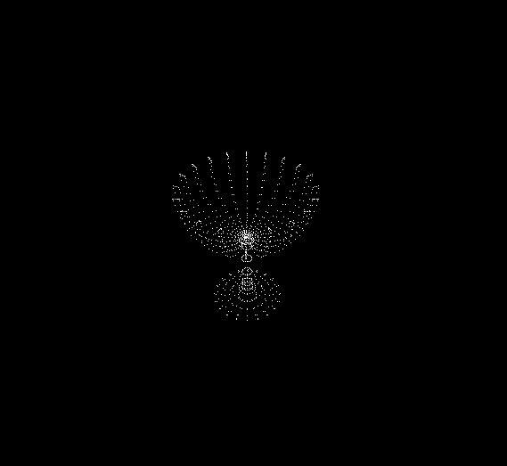

# UFRPE_CG
Projeto de conclusão da disciplina Computação Gráfica Básica.

## Especificação
Carregar na memória uma malha de triângulos referente a um objeto 3D armazenada em
arquivo de texto e desenhar seus vértices na tela. O arquivo utilizado para armazenar uma
malha com n vértices e k triângulos possui o seguinte formato:
```
<no de vértices> <no de triângulos>
<coordenada x do vértice 1> <coordenada y do vértice 1> <coordenada z do vértice 1>
<coordenada x do vértice 2> <coordenada y do vértice 2> <coordenada z do vértice 2>
...
<coordenada x do vértice n> <coordenada y do vértice n> <coordenada z do vértice n>
<índice do vértice 1 do triângulo 1> <índice do vértice 2 do triângulo 1> <índice do vértice 3 do triângulo 1>
<índice do vértice 1 do triângulo 2> <índice do vértice 2 do triângulo 2> <índice do vértice 3 do triângulo 2>
...
<índice do vértice 1 do triângulo k> <índice do vértice 2 do triângulo k> <índice do vértice 3 do triângulo k>
```
Exemplo de arquivo:
```
4 4
1 1 1
1 30 1
30 30 1
1 1 30
1 2 3
1 2 4
2 3 4
1 3 4
```

Uma vez que a malha foi carregada na memória, deve-se obter a projeção em perspectiva de seus vértices.  
A aplicação lê os parâmetros da câmera virtual do arquivo `cam.properties`.
### cam.properties
| propriedade | tipo | descrição |
| :---: | :---: | :--- |
| Nx | numérico | Componente x do vetor N da base.
| Ny | numérico | Componente y do vetor N da base.
| Nz | numérico | Componente z do vetor N da base.
| Vx | numérico | Componente x do vetor V da base.
| Vy | numérico | Componente y do vetor V da base.
| Vz | numérico | Componente z do vetor V da base.
| Cx | numérico | Componente x do ponto focal.
| Cy | numérico | Componente y do ponto focal.
| Cz | numérico | Componente z do ponto focal.
| d  | numérico | Distância do plano de vista.
| hx | numérico | Largura do retângulo de vista.
| hy | numérico | Altura do retângulo de vista.

A iluminação é calculada utilizando o modelo de iluminação de Phong. A aplicação lê os parâmetros de iluminação do arquivo `light.properties`
### light.properties
| propriedade | tipo | descrição |
| :---: | :---: | :--- |
| Iambr | numérico | Componente vermelha da cor de luz ambiental.
| Iambg | numérico | Componente verde da cor de luz ambiental.
| Iambb | numérico | Componente azul da cor de luz ambiental.
| Ka | numérico | Coeficiente de iluminação ambiental.
| Ilr | numérico | Componente vermelha da cor da luz.
| Ilg | numérico | Componente verde da cor da luz.
| Ilb | numérico | Componente azul da cor da luz.
| Plx | numérico | Componente x do ponto da luz.
| Ply | numérico | Componente y do ponto da luz.
| Plz | numérico | Componente z do ponto da luz.
| Kdr | numérico | Componente vermelha do coeficiente de iluminação difusa.
| Kdg | numérico | Componente verde do coeficiente de iluminação difusa.
| Kdb | numérico | Componente azul do coeficiente de iluminação difusa.
| Odr | numérico | Componente vermelha da cor difusa do objeto.
| Odb | numérico | Componente verde da cor difusa do objeto.
| Odg | numérico | Componente azul da cor difusa do objeto.
| Ka | numérico | Coeficiente especular.
| Theta | numérico | Modela o foco especular.

## Instalação
Desenvolvido em Python 3.10.12  
pygame 2.5.2
```bash
$ pip install -r requirements.txt
```


## Funcionamento
```bash
python main.py <1> <2>
```
O argumento <1> é o nome do arquivo contendo a malha triangular que deve estar contido em ./data  
O argumento <2> é a flag especificando o modelo de tonalização a ser executada. As flags possíveis são: {--flat, --gouraud, --phong}.  
Por exemplo:
```bash
python main.py 'calice2.byu' --phong
```
Uma vez que a malha foi carregada e a aplicação está rodando existem alguns comandos para visualizar diferentes tipos de renderização.  
| comando | descrição |
| :---: | :--- |
1 | Apenas os pontos em coordenadas de tela
2 | Linhas do algoritmo de Bresenham
3 | Sólido sem iluminação pelo Scanline
4 | Sólido iluminado
